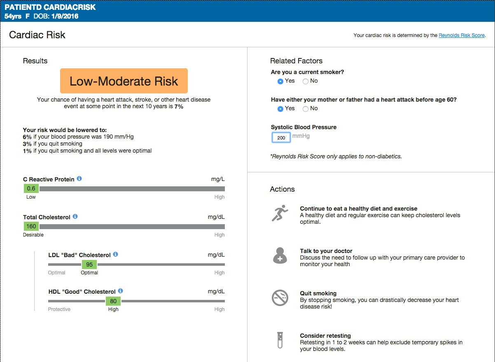

# Cardiac Risk App #
The widely-used [Reynolds Risk Score](http://www.reynoldsriskscore.org/) is used to estimate the 10-year cardiovascular risk of an individual. For patients and clinicians alike, this calculation is often reported in an esoteric, hard-to-read lab report.

For our model of an improved Reynolds Risk Score reporting SMART App, we took an [inspired Creative Commons design](http://www.informationisbeautiful.net/2010/visualizing-bloodtests/), the work of designer [David McCandless](http://www.davidmccandless.com/), whose “Blood Work Cardiology Result” appeared in the Wired Magazine article ["The Blood Test Gets a Makeover"](http://www.wired.com/2010/11/ff_bloodwork/all) (Wired 18.12, December 2010) and was published under a Creative Commons license. The resulting SMART Cardiac Risk app presents relevant patient vitals and lab measurements and the calculated Reynolds Risk Score, along with a succinct, patient-friendly explanation for each result. The app’s presentation produces a highly attractive document to hand to a patient. Furthermore, the SMART Cardiac Risk app also offers simulation: the clinician (or patient) can make changes to one or more of their smoking and family hustory and blood pressure to see how the patient’s current Reynolds Risk Score could be improved.

App Design:


# Running Locally #

In order to run the Cardiac Risk app locally, you need to run a local webserver.
You can use the [http-server](https://www.npmjs.com/package/http-server) from [NPM](https://www.npmjs.com/).
Additionaly, you will need [fhirclient](https://www.npmjs.com/package/fhirclient) to run the fhir-client dependency.

1. Install [NPM](https://github.com/npm/npm#super-easy-install)
2. You would need http-server (to run the project locally) and fhirclient. Run ```npm install``` and all the necessary node_modules will be installed on your system.
3. Skip this step if Step 2 was a success : Run ```npm install http-server -g``` for installing http-server and ```npm install fhirclient``` for fhir-client.
4. Clone down the project and update location for your node_modules/fhirclient/fhir-client.min.js file in index.html and launch.html.
5. Navigate to the directory containing ```launch.html```
6. Run ```http-server -c-1 -p 8000```
7. Open the following link to run on Cerner domains : ```https://smart.devcernerpowerchart.com/smart/2c400054-42d8-4e74-87b7-80b5bd5fde9f/apps?PAT_PersonId=<PatientID>&VIS_EncntrId=<EncounterID>&USR_PersonId=<PersonID>&PAT_PPRCode=1116&username=<UserName>&need_patient_banner=true``` .
   Example values for deveng domain at cerner :
       PatientID : 6456074
       EncounterID : 5003173
       PersonID : Substitute with your person id in deveng domain
       UserName : Substitute with your username.

# Build #

This project uses [Grunt](http://gruntjs.com/) to build the application. This will lint the project and create the build file.

1. If you have ran the step 2 from run locally then you dont need to install grunt. ( Incase if grunt fails to run install Grunt CLI: ```npm install -g grunt-cli```).
2. Just typing ```grunt``` will show all possible available tasks as specified in the Gruntfile.js
3. Run the following command while in the root directory of the application: ```grunt build```
4. This should create the cardiac_risk.css and cardiac_risk.js. It will also run minification jobs on these files and will lint them.

These files are referenced in the HTML file index.html.
The ```build/``` folder in the project acts as the final version's of these files to be used where as the ```src/``` folder is more for development.

# App Development/Improvements Process #
1. Make all the necessary changes to the files available in the ```src/``` directory.
2. Once changes are made run ```grunt build```
3. Run the application locally.

# Testing #

This project uses the [Mocha](http://mochajs.org/) testing framework to perform asynchronous unit testing.

To run the Mocha framework:

1. Follow step 2 from Running Locally and it should install all the necessary ingredients for testing.
2. Run Mocha tests: ```grunt test```

The tests are written in the files available in the  ```test/``` folder.

## Issues

Please browse our [existing issues](https://github.com/smart-on-fhir/cardiac-risk-app/issues) before logging new issues

## Contributing

See [CONTRIBUTING.md](CONTRIBUTING.md)

## License

Licensed under the Apache License, Version 2.0 (the "License"); you may not use this file except in compliance with the License. You may obtain a copy of the License at

http://www.apache.org/licenses/LICENSE-2.0 Unless required by applicable law or agreed to in writing, software distributed under the License is distributed on an "AS IS" BASIS, WITHOUT WARRANTIES OR CONDITIONS OF ANY KIND, either express or implied. See the License for the specific language governing permissions and limitations under the License.